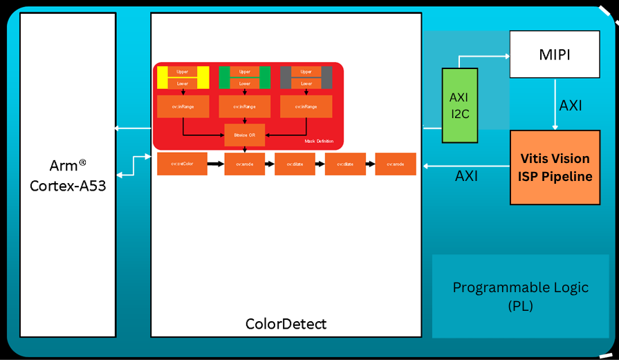

# Kria-Yocto-Vitis-Vision-Library
Repo on Kria KV260 with Vitis Vision Library test with Yocto

## Overview
This Kria app is based on running the accelerated ColorDetect algorithm on Kria KV260 starter kit on top of Yocto based OS image and comparing the latency or performance comparison of accelerated and OpenCV version of C based application which runs at the ARM A53 Quad core processor.

## Performance Comparison ColorDetect
Below is the performance comparison table of ColorDetect operation on OpenCV-C++ and XRT-C++ on Kria KV260 with Raspberry Pi Camera V2 (IMX219). 

| Performance Metrices | ColorDetect kernel at XRT C++ | OpenCV C++ |
| -------- | -------- | -------- |
| Latency    | 60.1932 ms    | 160.8 ms    |
| FPS   | 16.6 FPS   | 6.25 FPS    |

**Note** - the XRT Kernel Host app and OpenCV Host App both are running on Kria KV260 (with ARM A53, no multithreading or multiprocessing) with Sony IMX219 (Raspberry Pi Camera V2). The performance is calculated during the main ColorDetect operation excluding the MIPI data capture and file save after the process.

## Quickly evaluate this Kria-App
Please follow the Getting Started Guide - ***Getting_Started_Guide_Kria_Yocto_VitisVisionLibrary_App-v1_0.pdf*** from `/Documentations`
    - This GSG document highlight quick steps to run this design on KV260 Vision Starter Kit with Raspberry Pi v2 Camera.

## Application Hierarchy

├───Documentation \
├───Firmware \
│   ├───mipi-ispaccel-colordetect \
│   └───vadd \
├───HostApp \
│   ├───OpenCV-CPP-PS-ColorDetect \
│   └───xrt-ColorDetect-app \
│       └───frames \
├───Picture \
├───Vitis_VIVADO \
│   ├───System-Project \
│   ├───Vitis-Platform-Creation \
│   │   ├───VIVADO-Hardware-DemosiacISP \
│   │   └───VIVADO-Hardware-ISPAccel \
│   └───Vitis-Vision-Library-Kernel \
└───Yocto \
    └───KV260-meta-yocto-recipes \

## Acknowledgement

We are thankful to AMD team for their support for this Kria App.

### Any Queries or Questions ?
Please raise Github issue at this repo or contact info@logictronix.com for any queries or issues.

**LogicTronix is AMD Partner for FPGA Desgin and ML Acceleration**